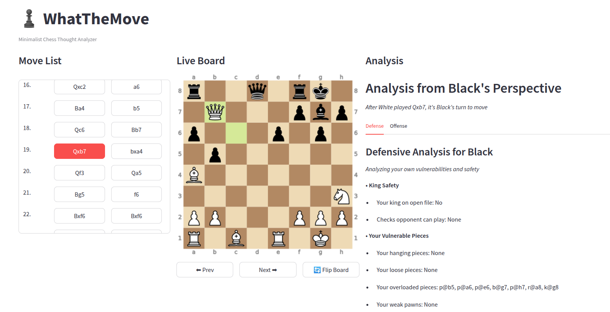

# WhatTheMove - Chess Thought Process Analyzer

WhatTheMove is a minimalist chess analysis tool that breaks down positions using a structured thought process. It helps chess players understand the key elements of each position and improve their analytical skills.



## Features

- **PGN Analysis**: Upload any PGN file to analyze games
- **ORIENT Framework**: Analyzes positions using a structured approach:
  - **O**bserve kings (safety, checks, mate threats)
  - **R**ecognize "things" (hanging, loose, overloaded pieces)
  - **I**dentify "strings" (pins, discovered attacks)
  - **E**valuate position
  - **N**ote tactical opportunities
  - **T**hink strategically
- **Dual Perspective**: See analysis from both White and Black's viewpoint
- **Interactive Board**: Navigate through the game with a visual chessboard
- **Clean Interface**: Minimalist design focused on the analysis

## Installation

1. Clone this repository:

   ```
   git clone https://github.com/yourusername/whatthemove.git
   cd whatthemove
   ```

2. Create a virtual environment and install dependencies:

   ```
   python -m venv venv
   source venv/bin/activate  # On Windows: venv\Scripts\activate
   pip install -r requirements.txt
   ```

3. Run the application:
   ```
   streamlit run src/app.py
   ```

## Requirements

- Python 3.7+
- Streamlit
- python-chess
- cairosvg
- Pillow

## Usage

1. Launch the application
2. Upload a PGN file using the sidebar
3. Navigate through moves using the move list or navigation buttons
4. View the analysis for each position from both perspectives
5. Use the insights to understand the key elements of each position

## Project Structure

```
whatthemove/
├── src/
│   └── app.py          # Main Streamlit application
├── design-docs/        # Design documentation
│   ├── streamlit-gui.py       # UI design specification
│   ├── project-goals.txt      # Project goals and requirements
│   ├── design-specs.txt       # Technical design specifications
│   └── important_design_vision.txt  # Vision document
├── sample.pgn          # Example PGN file
├── requirements.txt    # Python dependencies
├── .gitignore          # Git ignore file
└── README.md           # This file
```

## Contributing

Contributions are welcome! Please feel free to submit a Pull Request.

1. Fork the repository
2. Create your feature branch (`git checkout -b feature/amazing-feature`)
3. Commit your changes (`git commit -m 'Add some amazing feature'`)
4. Push to the branch (`git push origin feature/amazing-feature`)
5. Open a Pull Request

## License

This project is licensed under the MIT License - see the LICENSE file for details.

## Acknowledgments

- Built with [Streamlit](https://streamlit.io/)
- Chess functionality powered by [python-chess](https://python-chess.readthedocs.io/)
- Inspired by structured chess thinking processes
